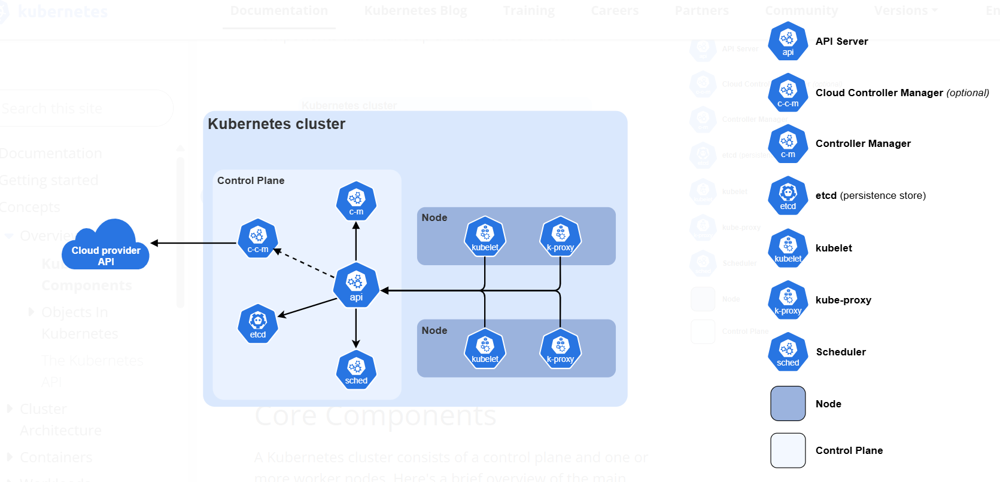

# Overview

## Kubernetes Components
The Kubernetes cluster components includes controller plan and one or more worker nodes. The key components that make up the Kubernetes cluster includes:
1. Node: Maintains running pods and providing the kubernetes environment runtime. The node components includes.
- Kubelet: Ensure pods are running including their containers
- Kube-proxy: Maintain the network rule on node to run the service
2. Control Plan: Manages the overall state of the clouster. The components inclues:
- API Server: Exposes the kubernetes HTTP API
- Etcd: Serves as the key value store for all API server data
- Kube-Controller manager: Runs controller to implement kubernetes API behavior
- Kube-scheduler: Responsible for assiging pod to the suitable node


## Container Runtime
Softwares responsible for running containers includes:
1. CRI-O - Container Runtime Interface
2. Docker Engine
3. Containerd
4. Mirantis Container Runtime

## Objects in Kubernetes
Kubernetes objects are persistent entities in kubernetes system. The entities are used by kubernetes to represent the state of the cluster.
Specifically, they can describe:
- What containerized applications are running (and on which nodes)
- The resources available to those applications
- The policies around how those applications behave, such as restart policies, upgrades, and fault-tolerance.

To work with Kubernetes objects—whether to create, modify, or delete them—you'll need to use the Kubernetes API.For example ``kubectl``, ``Client libraries``.

Here's an example manifest that shows the required fields and object spec for a Kubernetes Deployment:

```
apiVersion: apps/v1
kind: Deployment
metadata:
  name: nginx-deployment
spec:
  selector:
    matchLabels:
      app: nginx
  replicas: 2 # tells deployment to run 2 pods matching the template
  template:
    metadata:
      labels:
        app: nginx
    spec:
      containers:
      - name: nginx
        image: nginx:1.14.2
        ports:
        - containerPort: 80

```
### Required field
In the manifest (YAML or JSON file) for the kubernetes object you want to create, you will need to set values for the following fields:
- _apiVersion_: Specify the version of Kubernetes you are using to create this opject
- _kind_: Specify the kind of object you want to create
- _metadata_: Specify the data that help uniquely identify the object e.g _name_, _UID_, and _namespace_ (optional)
- _spec_: Specify the state you desire for the object

### Server side field validation
The API server offers server side field validation that detects unrecognized or duplicate fileds in an object.

The ``kubectl`` tools uses the ``--validate`` flag to set the level of field validation. It accepts
- _true_ equivalent to _strict_: strict field validation, errors on validation failure
- _false_ equivalent to _ignore_: No server side field validation is performed
- _warn_: Errors are exposed as wanings rather than failing the request
The default validation setting for ``kubectl`` is ``--validation`` is ``--validation=true``.

## Pod
A Pod in Kubernetes is the smallest and simplest unit that Kubernetes runs. Think of a Pod like a small box that holds one or more containers that work together.

A Pod is a group of one or more containers, with shared storage and network resources, and a specification for how to run the containers.

Pods in a kubernetes clusters are used in two ways:
1. _Pods that run a single container_
2. _Pods that runs multiple containers that need to work together_

```
apiVersion: v1
kind: Pod
metadata:
  name: nginx
spec:
  containers:
  - name: nginx
    image: nginx:1.14.2
    ports:
    - containerPort: 80
```
Pods are generally not created directly and are created using workload resources. Example of wordload resources that manages one or more pods are:
- _Deployment_: provides declarative update for pods and replicaSets
- _StateFulSet_: is the workload API object used to mange stateful applications. A StatefulSet runs a group of Pods, and maintains a sticky identity for each of those Pods. This is useful for managing applications that need persistent storage or a stable, unique network identity.
- _DaemonSet_: ensure that all Nodes run a copyof a pod. As noes are added to the cluster, pods are added to them. As nodes are removed from the cluster, those pods are garbage collected. Deleting a DaemonSet will clean up the Pods it created.

## Kubernetes Object Management Techniques
1. _Imperative commands_: You run direct commands and kubernetes perform the action immediately. No configuration file is required. Commands are executed one-by-one and changes are not stored anywhere.
```
kubectl create deployment nginx --image nginx
```
2. _Imperative object configuration_: You create a YAML file and explicitly tell Kubernetes to create, update or delete it. More repeatable than imperative commands, configuration is stored in files. No automatic tracking of changes.
3. _Declarative object configuration_: You declared the desired state, Kubernetes figire out how to do it.
Example
```
kubectl apply -f deployment.yaml
```
If you change the YAML and reapply:
```
kubectl apply -f deployment.yaml
```
- #### Object Names and IDs
Each object in your cluster has a _Name_ that is unique for that type of resource. Every Kubernetes object also has a _UID_ that is unique across your whole cluster.
- #### Labels and Selectors
Labels are key/value pairs that are attached to objects such as Pods.  Labels can be attached to objects at creation time and subsequently added and modified at any time.

Example labels:

- ``"release" : "stable", "release" : "canary"``
- ``"environment" : "dev", "environment" : "qa", "environment" : "production"``
- ``"tier" : "frontend", "tier" : "backend", "tier" : "cache"``
- ``"partition" : "customerA", "partition" : "customerB" "track" : "daily", "track" : "weekly"``

For example, here's a manifest for a Pod that has two labels ``environment: production`` and ``app: nginx``
```
apiVersion: v1
kind: Pod
metadata:
  name: label-demo
  labels:
    environment: production
    app: nginx
spec:
  containers:
  - name: nginx
    image: nginx:1.14.2
    ports:
    - containerPort: 80
```
- #### Namespaces
In Kubernetes, namespaces provide a mechanism for isolating groups of resources within a single cluster. Names of resources need to be unique within a namespace, but not across namespaces.

Namespaces are intended for use in environments with many users spread across multiple teams, or projects

##### Initial namespaces
1. Default
2. Kube-node-lease
3. Kube-public
4. Kube-system

- #### Annotations
You can use Kubernetes annotations to attach arbitrary non-identifying metadata to objects. Clients such as tools and libraries can retrieve this metadata. 

##### Attaching metadata to objects
You can use either labels or annotations to attach metadata to Kubernetes objects. Unlike labels, annotations are not used to select or group objects.

##### Where are Annotations Used?

Annotations can be added to almost any Kubernetes object:
- Pods
- Services
- Deployments
- ConfigMaps
- Ingress

Example prometheus scraping, ingress annotations
```
annotations:
  prometheus.io/scrape: "true"
  prometheus.io/port: "9090"
```

#### Field Selectors
Field selectors let you select Kubernetes objects based on the value of one or more resource fields. Here are some examples of field selector queries:

- metadata.name=my-service
- metadata.namespace!=default
- status.phase=Pending
This ``kubectl`` command selects all Pods for which the value of the ``status.phase`` field is Running:
```
kubectl get pods --field-selector status.phase=Running
```

#### Finalizers
Finalizers are namespaced keys that tell Kubernetes to wait until specific conditions are met before it fully deletes resources that are marked for deletion. Finalizers alert controllers to clean up resources the deleted object owned.

#### Owners and Dependents
In Kubernetes, some objects are owners of other objects. For example, a ReplicaSet is the owner of a set of Pods. These owned objects are dependents of their owner.