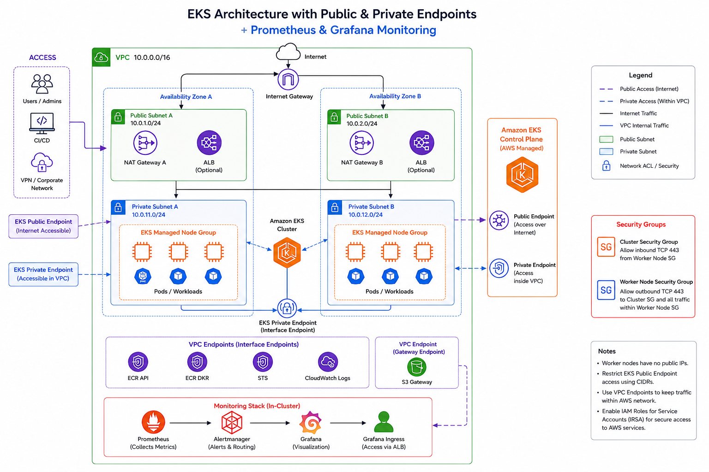

# Enterprise Kubernetes Platform on AWS EKS

[](https://github.com/Emmy-github-webdev/Kubernetes/actions/workflows/terraform.yml)
[](https://github.com/Emmy-github-webdev/Kubernetes/tree/main)
[](https://www.terraform.io/)
[](https://aws.amazon.com/eks/)
[](https://github.com/Emmy-github-webdev/Kubernetes)

## Description

This repository is the infrastructure backbone for an enterprise-grade, cloud-native platform running containerized applications on Amazon EKS. It forms the foundation of a multi-repository delivery model that spans platform provisioning, application delivery, and GitOps-based deployment operations.

### Repository ecosystem

- Infrastructure repository: [Kubernetes](https://github.com/Emmy-github-webdev/Kubernetes/tree/main)
- Application source repository: [ja-mics-ap](https://github.com/Emmy-github-webdev/ja-mics-ap)
- GitOps repository: [kubernetes-argocd](https://github.com/Emmy-github-webdev/Kubernetes-argocd)

The platform combines Infrastructure as Code, secure networking, Kubernetes-native delivery, observability, and CI/CD automation to support development, staging, and production environments with strong governance, traceability, and operational consistency.

## Why this platform exists

This platform was designed to support enterprise application delivery with a strong focus on security, reliability, and repeatability:

- Secure and scalable deployment of containerized workloads on AWS
- Consistent environment provisioning across development, staging, and production
- Strong separation between public and private application layers
- GitOps-driven deployment and environment promotion
- Production-grade monitoring, alerting, and operational visibility
- A reusable foundation for future services, platform expansion, and team enablement

## Drawbacks and trade-offs

While this architecture is powerful and enterprise-friendly, it also introduces some trade-offs:

- Higher initial setup and platform complexity
- Greater operational responsibility for Kubernetes and cloud networking
- Additional cost for multi-AZ, private networking, monitoring, and managed services
- A steeper learning curve for teams adopting GitOps and platform engineering practices

## Architecture



The platform is organized around three repositories and a clear delivery flow:

1. [Infrastructure repository](https://github.com/Emmy-github-webdev/Kubernetes)
   - Provisions networking, EKS, IAM, security groups, load balancers, databases, cache, and shared platform services using Terraform.
   - Implements environment-specific modules for dev, staging, and prod.

2. [Application repository](https://github.com/Emmy-github-webdev/ja-mics-ap)
   - Contains the application source code, container build logic, and application-level CI/CD automation.
   - Produces container images and publishes them to the configured registry.

3. [GitOps repository](https://github.com/Emmy-github-webdev/Kubernetes-argocd)
   - Stores Kubernetes manifests, Argo CD application definitions, overlays, and monitoring configuration.
   - Synchronizes application deployment state from Git into the cluster.

### High-level deployment flow

- Developers commit changes to the application repository.
- CI pipelines build and validate the application.
- Container images are published to the appropriate registry.
- The GitOps repository is updated with the new image or manifest state.
- Argo CD detects and applies the changes to the EKS cluster.
- Kubernetes services run behind the platform networking and ingress layer.

## Prerequisites

Before using this platform, ensure the following tools are installed and configured:

- AWS CLI
- Terraform
- kubectl
- Helm
- Git
- Docker (recommended for application image builds)

Example verification commands:

```bash
aws sts get-caller-identity
terraform version
kubectl version --client
helm version
```

## Quick start guide

1. Clone the infrastructure repository.
2. Configure your AWS credentials and preferred region.
3. Review the environment modules under the infra/environments directory.
4. Initialize and plan the desired environment.
5. Apply the Terraform configuration to provision the platform.

Example:

```bash
git clone <https://github.com/Emmy-github-webdev/Kubernetes>
cd Kubernetes
terraform -chdir=infra/environments/dev init
terraform -chdir=infra/environments/dev plan
terraform -chdir=infra/environments/dev apply
```

> Replace the environment path and variables according to your deployment target and organizational conventions.

## Installation instructions

This repository is structured to support repeatable infrastructure deployment through Terraform modules.

### Environment setup

- Review the variables defined in each environment folder.
- Provide the required values through a tfvars file or environment-specific input configuration.
- Validate the configuration before applying changes.

### Recommended workflow

```bash
terraform -chdir=infra/environments/dev fmt -check
terraform -chdir=infra/environments/dev validate
terraform -chdir=infra/environments/dev plan
terraform -chdir=infra/environments/dev apply
```

For staging and production, follow the same process with the appropriate environment folder and approvals.

## Basic usage examples

### Validate infrastructure

```bash
terraform -chdir=infra/environments/dev validate
```

### Review planned changes

```bash
terraform -chdir=infra/environments/dev plan
```

### Apply changes

```bash
terraform -chdir=infra/environments/dev apply
```

### Remove deployed resources

```bash
terraform -chdir=infra/environments/dev destroy
```

## Comprehensive documentation

Additional project documentation is available here:

- [GITHUB_ACTION.md](GITHUB_ACTION.md)
- [README1.md](README1.md)

These documents provide deeper context on CI/CD workflows, Terraform automation, and platform operations.

## Contributing

Contributions are welcome. Please follow standard engineering practices:

- Create a feature branch for your work.
- Open a pull request with a clear description of the change.
- Ensure validation and review steps are completed before merging.
- Align your changes with the repository’s CI/CD and infrastructure standards described in [GITHUB_ACTION.md](GITHUB_ACTION.md).

## License

This repository does not currently include a license file. For enterprise adoption, align the repository with your organization’s approved licensing model before broader internal or public reuse.

## Technologies used

- Terraform
- AWS EKS
- Amazon VPC and networking services
- AWS IAM and security groups
- Application Load Balancer and ingress management
- Amazon RDS and Redis-compatible services
- Kubernetes and Helm
- Argo CD for GitOps delivery
- GitHub Actions for automation and validation
- Prometheus, Grafana, and Alertmanager for observability

---

This repository represents the infrastructure backbone for a secure, scalable, and enterprise-ready Kubernetes platform built for modern application delivery.
